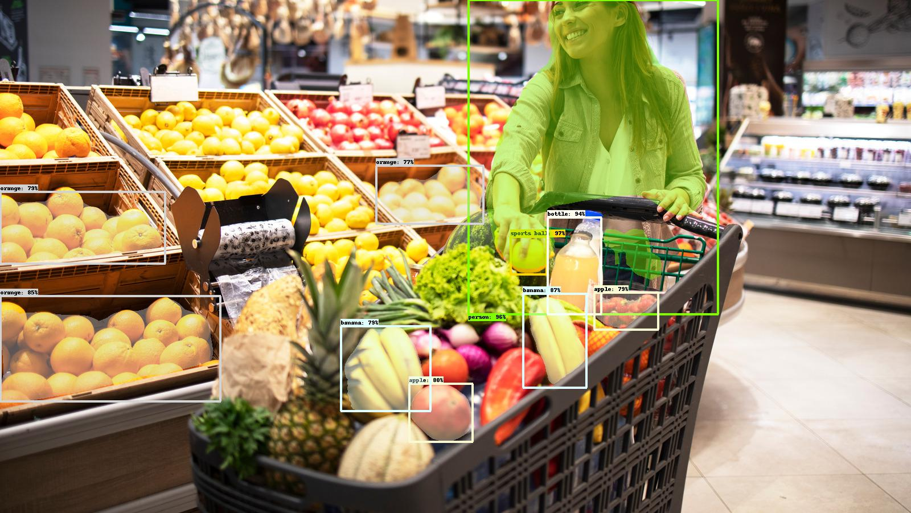

# Fruits and vegetables detection

The main code is written in the notebook "fruits-and-veggies-detection.ipynb". It contains a study of object detection models to detect a single fruit/vegetable or groups of fruits/vegetables. 
Two main approaches are discussed: training a model from scratch (VGG16) and using a pre-trained model (Mask RCNN).

Some masks were manually annotated with VIA (VGG Image annotator) in 'datasets'.

- The main notebook "fruits-and-veggies-detection.ipynb" was developed and executed in the kaggle environment.
- The notebook "Copy_of_Mask_R_CNN_Image_Segmentation_Demo.ipynb" was created and executed in the Google Colab environment.

- I created the dataset "datasets/fruits_and_veggies" by searching for images in Google images, using terms such as "fruits cashier", "vegetables cashier", "fruits and vegetables", "supermarket fruits", etc, and using a google chrome extension to download multiple images. Then, I filtered the dataset to high-resolution images, and to images that best fit the context I was looking for (fruits and vegetables in supermarkets, or cashiers, or "real" contexts).

